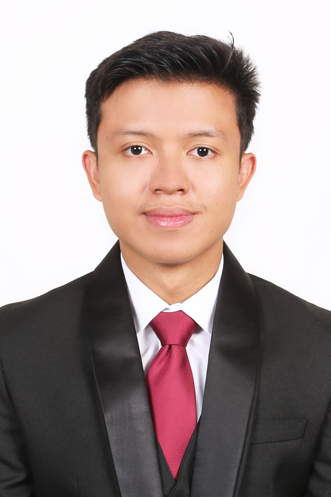

# About Us

We are a team based in the [School of Computing, National University of Singapore](http://www.comp.nus.edu.sg).

You can reach us at the email `seer[at]comp.nus.edu.sg`

## Project team

### Achmad Firdaus Assabil

[[github](https://github.com/mrmarshall12)]
[[portfolio](team/mrmarshall12.md)]

* Role: Developer
* Responsibilities: Integration

### Benedict Aurelius Tjia

[[github](http://github.com/BenedTj)]
[[portfolio](team/benedtj.md)]

* Role: Developer
* Responsibilities: Testing

### Chen Beitian

[[github](http://github.com/Chen-Beitian)] [[portfolio](team/chen-beitian.md)]

* Role: Developer
* Responsibilities: Data

### Chin Ling Xing, Lance

[[github](http://github.com/denselance-alt)]
[[portfolio](team/denselance-alt.md)]

* Role: Developer
* Responsibilities: Ensure timely submission of deliverables and code quality

### Elijah Ng Ding Jie

[[github](https://github.com/elijah-ng)]
[[portfolio](team/elijah-ng.md)]

* Role: Developer
* Responsibilities: Document project tasks and meeting notes. Ensure project deliverables are done on time and in the right format.  
